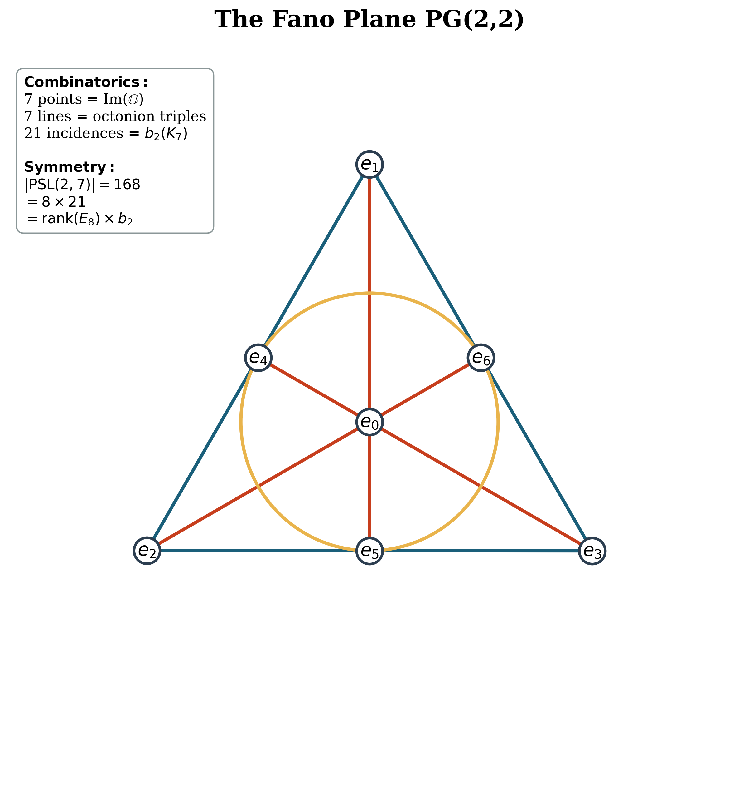

> 🇬🇧 [English](GIFT_FOR_EVERYONE.html) · 🇫🇷 **Français**

# GIFT pour Tout le Monde

**Un guide complet pour comprendre GIFT, expliqué pour des humains**

---

## Mode d'emploi

Chaque concept est présenté ainsi :
- **En jargon** — ce que disent physiciens et mathématiciens
- **Version comptoir** — ce que ça veut dire vraiment
- **Et dans GIFT** — pourquoi c'est important pour le cadre théorique

Que vous soyez étudiant curieux, amateur de sciences, ou simplement quelqu'un qui s'est déjà demandé "*pourquoi l'univers est comme il est ?*", ce guide est pour vous.

---

## Table des matières

1. [Introduction : qu'est-ce que GIFT ?](#introduction--quest-ce-que-gift-)
2. [Partie I : Les briques de base](#partie-i--les-briques-de-base)
   - [Les systèmes de nombres](#les-systèmes-de-nombres)
   - [Les groupes de symétrie](#les-groupes-de-symétrie)
3. [Partie II : La forme de l'univers](#partie-ii--la-forme-de-lunivers)
   - [Variétés et dimensions](#variétés-et-dimensions)
   - [K₇ : le diabolo cosmique](#k₇--le-diabolo-cosmique)
   - [Topologie : la mathématique de la pâte à modeler](#topologie--la-mathématique-de-la-pâte-à-modeler)
4. [Partie III : Les particules](#partie-iii--les-particules)
   - [Fermions et bosons](#fermions-et-bosons)
   - [Le zoo des particules](#le-zoo-des-particules)
5. [Partie IV : Les forces](#partie-iv--les-forces)
6. [Partie V : Les nombres magiques](#partie-v--les-nombres-magiques)
7. [Partie VI : Pourquoi GIFT est différent](#partie-vi--pourquoi-gift-est-différent)
8. [Partie VII : Les expériences](#partie-vii--les-expériences)
9. [Les personnages clés](#les-personnages-clés)
10. [Tableau récapitulatif](#tableau-récapitulatif)
11. [Index alphabétique](#index-alphabétique)

---

# Introduction : qu'est-ce que GIFT ?

**GIFT** (*Geometric Information Field Theory*, ou « théorie géométrique des champs d'information ») propose que les constantes fondamentales de la physique — des nombres comme 1/137, les masses des particules, l'intensité des forces — ne sont pas arbitraires. Elles émergent de la **forme** des dimensions cachées de l'univers.

**L'idée centrale en une phrase** : l'univers possède 7 dimensions cachées repliées dans une forme particulière qu'on appelle **K₇**, et les propriétés de cette forme déterminent mathématiquement tout ce que nous mesurons.

**Pourquoi est-ce que ça vous concerne ?**

Le Modèle Standard de la physique compte **19 paramètres libres** — des nombres qu'on mesure mais qu'on ne sait pas expliquer. Pourquoi l'électron est-il 1836 fois plus léger que le proton ? Pourquoi y a-t-il exactement 3 familles de particules ? Pourquoi la constante de structure fine vaut-elle 1/137 ?

GIFT propose des réponses : **zéro paramètre libre**. Tout vient de la géométrie.

---

# Partie I : Les briques de base

## Les systèmes de nombres

### Les nombres réels (ℝ)

**En jargon** : Corps des nombres réels, dimension 1.

**Version comptoir** : Une règle. Ce sont les nombres de tous les jours : 1, 2, 3,14159..., -7, √2. On peut les placer sur une ligne infinie.

**Et dans GIFT** : la brique élémentaire. Tout le reste se construit par-dessus.

---

### Les nombres complexes (ℂ)

**En jargon** : Extension des réels avec une unité imaginaire i² = -1, dimension 2.

**Version comptoir** : Une carte au trésor. Avec les nombres réels, vous ne pouvez aller qu'à gauche ou à droite sur une ligne. Avec les complexes, vous avez une **carte 2D** : gauche/droite ET haut/bas. Le nombre « i » est tout simplement « un pas vers le haut ». Et i × i = -1 signifie « deux pas vers le haut = demi-tour ».

**Usage quotidien** : l'électricité de votre maison utilise des nombres complexes ! Le courant alternatif « tourne » comme une aiguille sur la carte.

**Et dans GIFT** : les complexes décrivent les phases des ondes quantiques.

---

### Les quaternions (ℍ)

**En jargon** : Algèbre à division de dimension 4 avec trois unités imaginaires i, j, k.

**Version comptoir** : La manette de jeu vidéo. Vous voulez faire tourner un personnage 3D dans un jeu ? Les quaternions ont **4 composantes** (1 réelle + 3 imaginaires : i, j, k) qui permettent de décrire n'importe quelle rotation 3D sans « blocage de cardan » (le bug où deux axes se confondent).

**Anecdote** : découverts en 1843 par Hamilton, qui a gravé la formule i² = j² = k² = ijk = -1 sur un pont de Dublin !

**Et dans GIFT** : étape intermédiaire vers les octonions. Montre que les systèmes de nombres « grandissent » par puissances de 2.

---

### Les octonions (𝕆)

**En jargon** : Algèbre à division de dimension 8, non-associative.

**Version comptoir** : Le kit de Lego ULTIME.

| Système | Dimension | Ce qu'on peut faire |
|---|---|---|
| Réels | 1 | Mesurer une longueur |
| Complexes | 2 | Rotations 2D, électricité |
| Quaternions | 4 | Rotations 3D, jeux vidéo |
| **Octonions** | **8** | **Tout ce qui est possible** |

Après les octonions, **il n'y a plus rien**. Mathématiquement prouvé (théorème de Hurwitz, 1898). C'est le système de nombres le plus riche qui existe.

**La bizarrerie** : les octonions ne sont pas « associatifs ». (a × b) × c ≠ a × (b × c). C'est comme si l'ordre dans lequel vous assemblez vos Lego changeait le résultat final !

**Et dans GIFT** : l'univers utilise le kit le plus complet possible. Les 7 unités imaginaires des octonions donnent les 7 dimensions de K₇.

---

### Sédénions et au-delà

**En jargon** : Algèbre de dimension 16, mais qui n'est plus une algèbre à division.

**Version comptoir** : Le kit Lego défectueux. On peut continuer à doubler : 16, 32, 64... Mais à partir de 16, les « Lego » ne s'emboîtent plus correctement. Vous pouvez avoir des pièces qui, multipliées entre elles, donnent zéro alors qu'aucune des deux n'est nulle. C'est cassé.

**Et dans GIFT** : ça explique pourquoi la nature s'arrête aux octonions. Pas le choix, c'est la dernière algèbre « propre ».

---

### Le plan de Fano

**En jargon** : Le plus petit plan projectif fini, PG(2,2).

**Version comptoir** : Le réseau social parfait.

7 personnes, 7 groupes WhatsApp :
- Chaque groupe contient exactement 3 personnes
- Chaque personne est dans exactement 3 groupes
- Deux personnes quelconques partagent exactement 1 groupe

C'est la configuration la plus « efficace » possible. Pas de redondance, pas de manque.

**Le truc magique** : ce réseau possède 168 manières de se réarranger tout en gardant la même structure — c'est le groupe de symétrie qu'on appelle **PSL(2,7)**, d'ordre 168. Et là, tenez-vous bien : 168 ÷ 56 = **3**. Trois familles de particules.

D'où vient le 56 ? C'est la dimension de la « représentation fondamentale » de E₇ — la **plus petite manière non triviale** dont le gigantesque groupe exceptionnel E₇ peut agir sur un espace vectoriel (on rencontrera E₇ quelques sections plus bas). Le plan de Fano (petit, fini, 7 points) et E₇ (énorme, continu, 133 dimensions) sont liés à travers les échelles. Leur rapport tombe pile sur le nombre de générations de fermions qu'on observe. GIFT affirme : ce n'est pas une coïncidence — c'est la géométrie qui se parle à elle-même à travers les dimensions.

**Et dans GIFT** : le plan de Fano encode la multiplication des octonions. C'est la « table de multiplication » de l'univers.

---

## Les groupes de symétrie

### Qu'est-ce qu'un groupe ?

**En jargon** : Un ensemble muni d'une opération associative, avec un élément neutre et des inverses.

**Version comptoir** : Un club avec des règles.

Un groupe mathématique, c'est comme un club où :
- Il y a des **membres** (les éléments)
- Deux membres peuvent **se combiner** pour en faire un troisième (l'opération)
- Il y a un membre qui **ne change rien** (l'identité, comme « 0 » pour l'addition)
- Chaque membre a un **opposé** qui l'annule (l'inverse)

**Exemple simple** : les rotations d'un carré forment un groupe. Vous pouvez tourner de 0°, 90°, 180°, 270°. Deux rotations combinées = encore une rotation. La rotation à 0° ne change rien. Chaque rotation a son inverse.

---

### U(1) : le groupe du cercle

**En jargon** : Groupe unitaire de dimension 1, isomorphe au cercle.

**Version comptoir** : L'aiguille de l'horloge. U(1) regroupe toutes les manières de pointer dans une direction sur un cercle. L'aiguille peut être à midi, à 3 heures, à 7 heures 42... c'est un continuum de positions.

**En physique** : c'est le groupe de symétrie de l'**électromagnétisme**. Changer la « phase » d'une particule chargée (comme faire tourner l'aiguille) ne change pas la physique observable.

**Et dans GIFT** : U(1) émerge naturellement de structures plus grandes comme E₈.

---

### SU(2) : le groupe des rotations quantiques

**En jargon** : Groupe spécial unitaire de dimension 2, revêtement double de SO(3).

**Version comptoir** : Le ruban de Möbius des rotations.

Imaginez que vous tournez sur vous-même de 360°. Normalement, vous êtes revenu au point de départ, non ?

**Pas en mécanique quantique !** Il faut tourner de **720°** (deux tours complets) pour vraiment revenir à l'état initial. C'est comme si l'univers comptait les demi-tours.

SU(2) capture cette bizarrerie : il a « deux fois plus » d'éléments que les rotations ordinaires.

**En physique** : c'est le groupe de la **force faible** (celle qui cause la radioactivité). Il décrit aussi le **spin** de l'électron.

**Et dans GIFT** : SU(2) est contenu dans G₂ et dans E₈.

---

### SU(3) : le groupe de couleur

**En jargon** : Groupe spécial unitaire de dimension 3, dimension 8.

**Version comptoir** : Le mélangeur de peinture RVB.

Les quarks ont une propriété qu'on appelle « couleur » (rien à voir avec les vraies couleurs, c'est juste un nom). Il y a 3 couleurs : rouge, vert, bleu.

SU(3) décrit toutes les manières de **mélanger ces couleurs**, comme un mélangeur de peinture sophistiqué qui peut transformer le rouge en vert, le vert en bleu, etc.

**En physique** : c'est le groupe de la **force forte** (celle qui colle les quarks ensemble). Les 8 « gluons » correspondent aux 8 dimensions de SU(3).

**Et dans GIFT** : dim(SU(3)) = 8 = dim(𝕆). Coïncidence ? GIFT dit que non.

---

### G₂ : le gardien des octonions

**En jargon** : Plus petit groupe de Lie exceptionnel, dimension 14, automorphismes des octonions.

**Version comptoir** : Le gardien des octonions.

Imaginez une boule de cristal avec des motifs à l'intérieur. G₂ est l'ensemble des transformations qui **préservent la structure des octonions**. C'est comme l'ensemble des manières de réarranger un Rubik's cube tout en gardant les règles du jeu intactes.

**Pourquoi 14 ?** Les octonions ont 7 unités imaginaires. Les transformations qui les préservent forment un espace de dimension 14. C'est un fait mathématique, pas un choix.

**Les 5 groupes exceptionnels** : G₂, F₄, E₆, E₇, E₈ — ce sont les « outsiders » de la classification des groupes de Lie. Ils n'appartiennent à aucune famille infinie.

**Et dans GIFT** : G₂ est PARTOUT. dim(G₂) = 14 apparaît dans Koide (14/21 = 2/3), dans δ_CP (7×14+99), etc.

---

### F₄ : le groupe intermédiaire

**En jargon** : Groupe de Lie exceptionnel de dimension 52.

**Version comptoir** : L'architecte de la maison à mi-chemin. F₄ est lié au « plan octonionique » (le plan projectif octonionique).

**Et dans GIFT** : dim(F₄) = 52 apparaît dans des calculs de pont d'échelle.

---

### E₆ : le groupe de la grande unification

**En jargon** : Groupe de Lie exceptionnel de dimension 78.

**Version comptoir** : Le grand-parent des symétries.

E₆ contient SO(10), qui contient SU(5), qui contient U(1)×SU(2)×SU(3). C'est comme l'arrière-grand-parent de toutes les symétries du Modèle Standard.

**Bonus** : E₆ a une représentation de dimension 27 liée à l'algèbre de Jordan exceptionnelle.

**Et dans GIFT** : l'algèbre de Jordan (dim 27) apparaît dans m_μ/m_e = 27^φ.

---

### E₇ : le groupe mystérieux

**En jargon** : Groupe de Lie exceptionnel de dimension 133.

**Version comptoir** : Le grand frère mystérieux. E₇ a une représentation fondamentale de dimension **56**. Et 168/56 = 3 !

**Et dans GIFT** : N_gen = |PSL(2,7)| / dim(fond(E₇)) = 168/56 = 3.

---

### E₈ : le titan des symétries

**En jargon** : Plus grand groupe de Lie exceptionnel, dimension 248.

**Version comptoir** : Le château de Versailles des mathématiques.

E₈ est le groupe de symétrie le plus complexe et le plus beau qui existe. Sa structure est si riche que :
- Sa plus petite représentation a déjà **248 dimensions** (autant que le groupe lui-même !)
- Son diagramme de racines ressemble à une étoile parfaitement équilibrée en 8 dimensions
- Il contient tous les autres groupes exceptionnels

**Anecdote** : en 2007, une équipe de 18 mathématiciens a mis 4 ans à calculer complètement la structure de E₈. Le résultat fait 60 gigaoctets !

**Et dans GIFT** : E₈ × E₈ (248 + 248 = 496 dimensions) est le groupe de symétrie fondamental. Le 248 apparaît dans m_τ/m_e = 7 + 10×248 + 10×99.

---

### Le groupe de Weyl

**En jargon** : Groupe de réflexions associé à un système de racines.

**Version comptoir** : Les symétries d'un kaléidoscope.

Imaginez un kaléidoscope. Les miroirs créent plusieurs reflets, et certaines configurations de miroirs créent des motifs qui se répètent régulièrement. Le groupe de Weyl est l'ensemble de ces « réflexions » pour un groupe de Lie donné.

**Pour E₈** : le groupe de Weyl a un ordre astronomique : 696 729 600.

**Et dans GIFT** : le « nombre de Weyl » Weyl = 5 apparaît dans diverses formules.

---

# Partie II : La forme de l'univers

## Variétés et dimensions

### Qu'est-ce qu'une variété ?

**En jargon** : Espace topologique localement euclidien.

**Version comptoir** : La surface de la Terre.

La Terre est ronde (une sphère), mais quand vous vous baladez dans votre quartier, ça ressemble à un plan plat.

Une variété, c'est pareil : **globalement** elle peut avoir une forme compliquée, mais **localement** (en zoomant) elle ressemble toujours à un espace « normal ».

- Surface d'un ballon = variété de dimension 2
- L'espace de votre salon = variété de dimension 3
- K₇ = variété de dimension 7

---

### Dimension

**En jargon** : Nombre de coordonnées indépendantes nécessaires pour préciser un point.

**Version comptoir** : Combien de questions pour vous trouver ?

- **1D** (ligne) : « À combien de mètres du départ ? » → 1 question
- **2D** (carte) : « Latitude ? Longitude ? » → 2 questions
- **3D** (espace) : « Latitude ? Longitude ? Altitude ? » → 3 questions
- **7D** (K₇) : il faut 7 nombres pour dire « où » vous êtes

**Et dans GIFT** : l'univers = 4D visibles + 7D cachées = 11D au total.

---

### Variété compacte

**En jargon** : Variété fermée et bornée.

**Version comptoir** : Une île contre l'océan infini.

- **Non compacte** : l'océan s'étend à l'infini. Vous pouvez nager indéfiniment sans revenir.
- **Compacte** : une île a des bords (ou est fermée sur elle-même comme une sphère). Vous ne pouvez pas aller infiniment loin.

La surface de la Terre est compacte : vous pouvez marcher longtemps, mais vous finirez par revenir à votre point de départ.

**Et dans GIFT** : K₇ est compacte — les 7 dimensions sont « repliées » sur elles-mêmes, pas infinies.

---

### Dimensions supplémentaires

**En jargon** : Dimensions spatiales compactifiées au-delà des 3+1 observables.

**Version comptoir** : Le tuyau d'arrosage.

De loin, un tuyau d'arrosage ressemble à une ligne (1 dimension).

De près, vous voyez que c'est un tube : chaque point sur la « ligne » est en réalité un petit cercle (1 + 1 = 2 dimensions).

L'univers, c'est peut-être pareil :
- De loin (notre échelle) : 3 dimensions d'espace + 1 de temps
- De très très près (échelle de Planck) : 3+1 + **7 dimensions enroulées** = 11 au total

Les 7 dimensions enroulées ont la forme de K₇.

**Et dans GIFT** : nous ne « voyons » pas K₇, mais ses propriétés dictent les constantes que nous mesurons.

---

### Variétés de Calabi-Yau vs G₂

**En jargon** : Variété kählérienne compacte à première classe de Chern nulle (Calabi-Yau) versus variété compacte à holonomie G₂.

**Version comptoir** : Les cousines de K₇.

Les espaces de Calabi-Yau sont les « formes cachées » utilisées dans la théorie des cordes traditionnelle. Ils ont 6 dimensions (pour faire 10 au total avec les 4 de l'espace-temps).

**Le problème** : il en existe des MILLIARDS (le fameux « paysage » de 10⁵⁰⁰ solutions). Lequel choisir ?

**Et dans GIFT** : K₇ (holonomie G₂, 7 dimensions) est plus contraint que Calabi-Yau (holonomie SU(3), 6 dimensions). G₂ atteint une précision 13 fois meilleure que les approches Calabi-Yau.

---

## K₇ : le diabolo cosmique

**En jargon** : Variété compacte de dimension 7 à holonomie G₂, construite par « somme connexe tordue ».

**Version comptoir** : Le diabolo cosmique.

Imaginez un diabolo (le jouet de jongleur) :
- Sa **forme** détermine comment il tourne
- La **ficelle** contrôle son mouvement
- L'**équilibre** dépend de tout ça

K₇ est un « diabolo à 7 dimensions » dont la forme est dictée par les octonions (via G₂).

**Ses caractéristiques** :
- 7 dimensions (comme les 7 unités imaginaires des octonions)
- 21 « bulles 2D » (b₂ = 21)
- 77 « bulles 3D » (b₃ = 77)
- Une courbure très particulière (holonomie G₂)

**Et dans GIFT** : tout découle de K₇. C'est LA forme de l'univers caché.

---

### Fibré

**En jargon** : Espace total se projetant sur un espace de base via des fibres.

**Version comptoir** : La brosse à cheveux.

Imaginez une brosse à cheveux :
- La **base** = le manche plat
- Les **fibres** = les poils (un à chaque point du manche)
- Le **fibré total** = la brosse entière

À chaque point de la base est attachée une « fibre ». Le tout forme le fibré.

**En physique** : l'espace-temps est la base, et à chaque point sont attachées des « fibres » contenant l'information sur les champs.

**Et dans GIFT** : K₇ est « fibré » au-dessus de l'espace-temps d'une manière spécifique.

---

## Topologie : la mathématique de la pâte à modeler

### Topologie vs géométrie

**En jargon** : Étude des propriétés invariantes par déformation continue.

**Version comptoir** : Pâte à modeler vs sculpture sur glace.

- **Géométrie** (sculpture sur glace) : les distances exactes comptent. Changez d'un millimètre et c'est foutu.
- **Topologie** (pâte à modeler) : vous pouvez étirer, écraser, tordre... tant que vous ne coupez pas et ne collez pas, c'est « la même chose ».

**Le classique** : tasse à café = donut. Les deux ont exactement 1 trou (l'anse de la tasse = le trou du donut). Vous pouvez déformer l'un en l'autre sans couper ni coller.

**Et dans GIFT** : les constantes physiques sont topologiques — elles viennent du « nombre de trous », pas des distances. C'est pour ça qu'elles sont stables et universelles.

---

### Invariants topologiques

**En jargon** : Quantités inchangées par déformation continue.

**Version comptoir** : L'ADN d'une forme.

Vous pouvez changer de coiffure, de vêtements, prendre ou perdre du poids... votre ADN reste le même.

Les invariants topologiques sont l'ADN des formes. Vous pouvez déformer K₇ de mille manières, b₂ restera 21 et b₃ restera 77.

**Et dans GIFT** : les constantes physiques = l'ADN de l'univers. Elles ne peuvent pas être différentes.

---

### Nombres de Betti

**En jargon** : Rangs des groupes d'homologie, comptant les cycles indépendants.

**Version comptoir** : Compter les trous dans le gruyère.

| Betti | Compte quoi | Exemple |
|---|---|---|
| b₀ | Morceaux séparés | 1 bloc de gruyère = 1 |
| b₁ | Tunnels traversants | Trou que vous pouvez traverser |
| b₂ | Bulles fermées | Cavité piégée |
| b₃ | « Hyper-bulles » 3D | (difficile à visualiser !) |

**Pour K₇** :
- b₀ = 1 (un seul morceau)
- b₁ = 0 (pas de tunnels)
- b₂ = 21 (21 bulles 2D indépendantes)
- b₃ = 77 (77 hyper-bulles 3D indépendantes)

**Pourquoi ces nombres précis ?**
- 21 = 3 × 7 (trois fois les 7 points du plan de Fano)
- 77 = 7 × 11 (sept fois 11)

**Et dans GIFT** : ces deux nombres suffisent à calculer presque toutes les constantes physiques ! Par exemple, sin²θ_W = 21/(77+14) = 3/13.

---

### Cohomologie

**En jargon** : Théorie duale de l'homologie, avec des cochaînes.

**Version comptoir** : Le cadastre cosmique.

Si l'homologie compte les trous, la cohomologie **les classe et les étiquette**.

C'est comme la différence entre :
- Compter les lacs sur une carte (homologie)
- Faire le registre officiel avec surface, profondeur, etc. (cohomologie)

**Et dans GIFT** : H² et H³ de K₇ donnent les espaces où « vivent » différents champs physiques.

---

### Holonomie

**En jargon** : Groupe des transformations obtenues par transport parallèle le long de boucles.

**Version comptoir** : Le test du Père Noël.

Le Père Noël quitte le pôle Nord avec sa boussole pointant vers le sud. Il va jusqu'à l'équateur, tourne à droite, fait le tour de la Terre, revient au pôle Nord.

**Résultat** : sa boussole a tourné de 90° ! Personne n'y a touché — c'est la **courbure de la Terre** qui l'a fait.

L'holonomie mesure « de combien les choses tournent quand on fait une boucle ».

**Holonomie G₂** = la courbure de K₇ fait tourner les choses exactement selon les règles de G₂ (les 14 directions autorisées).

**Et dans GIFT** : l'holonomie G₂ est ce qui relie la forme de K₇ aux octonions.

---

### Caractéristique d'Euler

**En jargon** : Somme alternée des nombres de Betti : χ = Σ(-1)ⁿ bₙ.

**Version comptoir** : La formule magique d'Euler.

Pour n'importe quel polyèdre : **Sommets - Arêtes + Faces = 2**

Un cube : 8 - 12 + 6 = 2 ✓
Un tétraèdre : 4 - 6 + 4 = 2 ✓

Cette formule se généralise à toutes les dimensions !

**Et dans GIFT** : χ(K₇) est lié au nombre de générations via l'indice d'Atiyah-Singer.

---

### Torsion

**En jargon** : Mesure de l'écart d'une connexion à être sans torsion.

**Version comptoir** : Le tire-bouchon.

Imaginez que vous marchez tout droit, mais que l'espace lui-même se « tord » comme un tire-bouchon. Vous finissez par avoir tourné sans le vouloir.

La torsion mesure cette « torsion » de l'espace.

**Sur K₇** : la torsion doit être très petite (κ_T = 1/61) pour que la physique soit cohérente.

**Et dans GIFT** : le théorème de Joyce garantit qu'on peut avoir une métrique sans torsion sur K₇.

---

### Formes différentielles

**En jargon** : Section d'un fibré extérieur, généralisations des fonctions et des champs de vecteurs.

**Version comptoir** : Le détecteur de flux.

Imaginez différents types de « détecteurs » :
- **0-forme** : thermomètre (mesure une valeur en un point)
- **1-forme** : anémomètre (mesure le flux à travers une ligne)
- **2-forme** : pluviomètre (mesure le flux à travers une surface)
- **3-forme** : compteur de volume (mesure ce qui entre dans un volume)

Les formes différentielles généralisent ça à toute dimension.

**Et dans GIFT** : la 3-forme φ (la forme associative de G₂) définit la structure de K₇.

---

# Partie III : Les particules

## Fermions et bosons

### Fermions

**En jargon** : Particules à spin demi-entier obéissant à la statistique de Fermi-Dirac.

**Version comptoir** : Les individualistes.

Les fermions sont des particules « antisociales » : **deux fermions ne peuvent jamais se trouver au même endroit dans le même état**.

C'est pour ça que la matière est solide ! Les électrons (des fermions) se repoussent mutuellement et ne se compriment pas à l'infini.

**La famille** : électrons, quarks, neutrinos, muons, taus...

**Le truc bizarre du spin** : il faut faire tourner un fermion de 720° (deux tours) pour revenir à l'état initial !

**Et dans GIFT** : les fermions sont associés à H³(K₇), donc b₃ = 77.

---

### Bosons

**En jargon** : Particules à spin entier obéissant à la statistique de Bose-Einstein.

**Version comptoir** : Les bons vivants.

Les bosons adorent être ensemble : **ils peuvent tous s'entasser au même endroit dans le même état**.

C'est ce qui rend possibles les lasers (plein de photons identiques) et les condensats de Bose-Einstein (matière ultra-froide).

**La famille** : photons, gluons, W, Z, Higgs, graviton (hypothétique)...

**Et dans GIFT** : les bosons sont associés à H²(K₇), donc b₂ = 21.

---

## Le zoo des particules

### Électron

**En jargon** : Lepton chargé de première génération, masse 0,511 MeV.

**Version comptoir** : La petite sœur.

L'électron est le lepton chargé le plus léger. C'est lui qui orbite autour des atomes et qui fait l'électricité.

Il a deux frères et sœurs plus lourds : le muon (×207) et le tau (×3477).

**Et dans GIFT** : l'électron définit l'échelle fondamentale λ_e = h/(m_e c).

---

### Muon et tau

**En jargon** : Leptons chargés de 2e et 3e génération.

**Version comptoir** : Les frères et sœurs en surpoids.

Exactement comme l'électron, mais plus lourds :
- **Muon** : ×207 (vit ~2 microsecondes)
- **Tau** : ×3477 (vit ~0,3 picoseconde)

Personne ne savait pourquoi ces rapports précis. GIFT répond :
- m_μ/m_e = 27^φ (le nombre d'or !)
- m_τ/m_e = 7 + 10×248 + 10×99 = 3477

**Et dans GIFT** : les trois sœurs (Koide) = dim(G₂)/b₂ = 14/21 = 2/3.

---

### Neutrinos

**En jargon** : Leptons neutres, très légers, faiblement interagissants.

**Version comptoir** : Les fantômes.

Les neutrinos traversent la matière comme si elle n'existait pas. Des milliards vous traversent chaque seconde sans que vous le sachiez.

Ils « oscillent » entre trois types (électron, muon, tau) en voyageant — c'est comme s'ils changeaient de costume en plein vol.

**Et dans GIFT** : les angles de mélange des neutrinos (θ₁₂, θ₁₃, θ₂₃) et la phase CP (δ = 197°) sont dérivés de la topologie.

---

### Quarks

**En jargon** : Fermions portant une charge de couleur, confinés dans des hadrons.

**Version comptoir** : Les prisonniers.

Les quarks sont **toujours** enfermés par groupes de 2 ou de 3. Vous ne pouvez jamais en voir un seul — c'est le « confinement ».

**Les 6 types** :
- Up, Down (légers, dans les protons et neutrons)
- Charm, Strange (moyens)
- Top, Bottom (lourds)

**Et dans GIFT** : des rapports comme m_s/m_d = 20 sont dérivés de la topologie.

---

### Boson de Higgs

**En jargon** : Boson scalaire du mécanisme de brisure de symétrie électrofaible.

**Version comptoir** : La mélasse cosmique.

Le champ de Higgs remplit l'univers entier comme une mélasse invisible. Les particules qui interagissent avec lui « se font coller » et acquièrent une masse. Celles qui n'interagissent pas (les photons) restent sans masse.

**Découverte** : 2012 au LHC, prix Nobel 2013.

**Et dans GIFT** : λ_H (couplage du Higgs) = √17/32 = √(dim(G₂) + N_gen) / 2^Weyl.

---

### Photon

**En jargon** : Boson de jauge de l'électromagnétisme, masse nulle, spin 1.

**Version comptoir** : Le messager de la lumière.

Le photon EST la lumière. Il transporte la force électromagnétique entre les particules chargées. Il voyage toujours à la vitesse de la lumière et n'a pas de masse.

**Et dans GIFT** : l'impédance du vide (377 ohms) est liée à α via les structures de E₈.

---

### Gluons

**En jargon** : Bosons de jauge de la chromodynamique quantique, au nombre de 8.

**Version comptoir** : La super-glu nucléaire.

Les gluons « collent » les quarks ensemble. Mais contrairement aux photons, les gluons **portent eux-mêmes la charge** (la couleur), donc ils interagissent entre eux !

**Pourquoi 8 ?** C'est la dimension de SU(3). Et 8 = dim(𝕆), la dimension des octonions !

**Et dans GIFT** : α_s = √2/12 (couplage fort) vient de dim(G₂) - 2 = 12.

---

### Bosons W et Z

**En jargon** : Bosons de jauge de l'interaction faible, massifs.

**Version comptoir** : Les messagers lourds.

W⁺, W⁻ et Z⁰ portent la force faible (celle qui est derrière la radioactivité). Contrairement au photon, ils sont très lourds (~80-90 GeV), ce qui explique pourquoi la force faible a une portée très courte.

**Et dans GIFT** : M_Z/M_W = √(13/10) vient de sin²θ_W = 3/13.

---

# Partie IV : Les forces

### Électromagnétisme

**En jargon** : Interaction U(1) entre charges électriques.

**Version comptoir** : Les aimants et l'électricité, c'est la même chose.

Maxwell a montré en 1865 que l'électricité et le magnétisme sont les deux faces d'une même force. La lumière est une onde électromagnétique.

- **Groupe de jauge** : U(1)
- **Porteur** : photon
- **Portée** : infinie

**Et dans GIFT** : α = 1/137,033 détermine son intensité.

---

### Force faible

**En jargon** : Interaction SU(2) responsable des désintégrations β.

**Version comptoir** : L'alchimiste cosmique.

La plupart des forces ne font que pousser et tirer les choses. La force faible, elle, est différente : elle peut **changer ce qu'une chose est**. Un neutron peut devenir un proton. Un quark down peut basculer en quark up. Un muon peut se désintégrer en un électron et deux neutrinos fantomatiques.

Imaginez une magicienne qui ne se contente pas de déplacer les cartes sur la table — elle transforme une dame de pique en valet de cœur en plein milieu du mélange. C'est ça, la force faible. Et comme un bon tour de scène, la transformation est subtile : ça ne marche qu'à très courte distance (10⁻¹⁸ mètres, beaucoup plus petit qu'un proton), et ça embarque une direction cachée (une chiralité, une « préférence pour la gauche ») qui est invisible à l'œil nu mais inscrite dans les équations.

- **Groupe de jauge** : SU(2)
- **Porteurs** : W⁺, W⁻, Z⁰
- **Portée** : ~10⁻¹⁸ m (très courte !)

**Et dans GIFT** : sin²θ_W = 3/13 décrit le mélange faible/EM.

---

### Force forte

**En jargon** : Interaction SU(3) entre quarks via les gluons.

**Version comptoir** : L'élastique de l'univers.

La plupart des forces s'**affaiblissent** avec la distance. La gravité, l'électromagnétisme — éloignez deux aimants l'un de l'autre et c'est de plus en plus facile de les séparer. La force forte fait l'**inverse** : éloignez deux quarks l'un de l'autre et la force *augmente*, comme un élastique qui s'étire. Tirez assez fort, et au lieu de se séparer, l'élastique casse et **deux nouveaux quarks se matérialisent** au point de rupture — un de chaque côté. Vous ne pouvez jamais isoler un seul quark ; l'univers refuse physiquement.

C'est pour ça qu'on ne voit jamais de « quarks libres » se balader. Ils sont en prison à perpétuité, par groupes de trois dans les protons et les neutrons, ou par groupes de deux dans les mésons. La force forte n'est pas juste forte — elle est **stratégiquement carcérale**.

- **Groupe de jauge** : SU(3)
- **Porteurs** : 8 gluons
- **Portée** : ~10⁻¹⁵ m

**Et dans GIFT** : α_s = √2/12 ≈ 0,1179 à l'échelle M_Z.

---

### Gravitation

**En jargon** : Courbure de l'espace-temps selon la relativité générale.

**Version comptoir** : Le trampoline cosmique.

Imaginez l'espace-temps comme un trampoline. Les masses « appuient » sur le trampoline et créent des creux. Les autres objets roulent vers ces creux — c'est ça la gravité !

- **Porteur (hypothétique)** : graviton (spin 2)
- **Portée** : infinie

**Et dans GIFT** : la gravité émerge potentiellement des structures E₈ × E₈ à l'échelle de Planck.

---

### Unification électrofaible

**En jargon** : U(1) × SU(2) unifiant EM et faible au-dessus de ~100 GeV.

**Version comptoir** : Le cocktail avant le mélange.

À très haute énergie, l'électromagnétisme et la force faible sont indistinguables — comme la vodka et le jus d'orange dans le verre avant qu'on les mélange.

En refroidissant, le « cocktail » se sépare : on obtient l'EM (le photon) et la faible (W, Z).

**L'angle de mélange** : sin²θ_W ≈ 0,231 dit « combien » de chaque.

**Et dans GIFT** : sin²θ_W = 21/91 = 3/13 = b₂/(b₃ + dim(G₂)).

---

### Groupes de jauge

**En jargon** : Groupe de symétrie locale définissant les interactions fondamentales.

**Version comptoir** : Les règles du jeu de cartes.

Dans un jeu de cartes, certaines règles définissent ce qui est « autorisé » :
- Au poker, une paire bat une carte haute
- Au bridge, les atouts battent tout

Un groupe de jauge, c'est **l'ensemble des règles qui définissent une force**.

- U(1) → règles de l'électromagnétisme
- SU(2) → règles de la force faible
- SU(3) → règles de la force forte
- E₈ × E₈ → les méta-règles de GIFT (d'où viennent toutes les autres)

**Et dans GIFT** : E₈ × E₈ est le « jeu de cartes original » dont tous les autres sont des simplifications.

---

# Partie V : Les nombres magiques

### Constante de structure fine (α ≈ 1/137)

**En jargon** : α = e²/(4πε₀ℏc) ≈ 1/137,036

**Version comptoir** : Le thermostat de l'univers.

Imaginez que vous puissiez tourner un seul bouton qui contrôle à quel point la lumière et la matière interagissent. Ce bouton, c'est α ≈ 1/137.

- **Tournez-le 4 % plus haut** : les étoiles arrêtent de fabriquer du carbone. Pas de carbone, pas nous.
- **Tournez-le 4 % plus bas** : les protons ne peuvent plus se lier dans les noyaux. Plus d'atomes plus lourds que l'hydrogène.
- **Tournez-le de 50 % en plus** : les atomes s'effondrent. L'univers devient pur rayonnement.

Pendant 60+ ans, les physiciens ont mesuré ce nombre avec une précision insensée (10 décimales aujourd'hui), mais sans avoir la moindre idée du **pourquoi** il a cette valeur plutôt qu'une autre.

Feynman, 1985 (*QED: The Strange Theory of Light and Matter*) : *« C'est l'un des plus grands sacrés mystères de la physique : un nombre magique qui nous arrive sans que l'humain le comprenne. On pourrait dire que la "main de Dieu" a écrit ce nombre, et "on ne sait pas comment Il a poussé Son crayon". »*

**La proposition de GIFT** : ce n'est pas magique. `α⁻¹ = 137,033` émerge de la topologie de K₇, sous la forme `128 + 9 + correction`, où `128 = 2⁷` (les 7 dimensions cachées de K₇) et `9 = 99/11` (un rapport d'invariants topologiques). Le « grand sacré mystère » de Feynman devient une **conséquence de la forme**.

---

### Angle de mélange faible (sin²θ_W ≈ 0,231)

**En jargon** : Paramètre du modèle électrofaible reliant les couplages.

**Version comptoir** : La recette du cocktail électrofaible.

À très haute énergie, l'électromagnétisme et la force faible sont **la même force**, comme du jus d'orange et de la vodka avant le mélange.

sin²θ_W ≈ 0,231 signifie « environ 23 % de force faible, 77 % d'électromagnétisme » dans le mélange final.

**GIFT** : sin²θ_W = 21/91 = 3/13

C'est le nombre de « bulles 2D » (21) divisé par le total (77 + 14 = 91).

**Et dans GIFT** : la recette du cocktail n'est pas arbitraire — elle est dictée par la forme du shaker cosmique (K₇).

---

### Relation de Koide (Q = 2/3)

**En jargon** : (√m_e + √m_μ + √m_τ)² / (m_e + m_μ + m_τ) = 2/3

**Version comptoir** : L'accord cosmique.

Les trois leptons chargés — électron, muon, tau — ont des masses extrêmement différentes (le tau est ~3500 fois plus lourd que l'électron). À première vue, on dirait des nombres au hasard que la nature a tirés d'un chapeau.

En 1982, le physicien japonais Yoshio Koide a remarqué quelque chose d'étrange. Prenez les **racines carrées** des trois masses. Additionnez-les. Élevez le résultat au carré. Divisez par la **somme** des masses. Vous obtenez... pas approximativement, pas « environ » — mais **exactement** 2/3, à la précision des meilleures mesures disponibles.

C'est comme si trois cailloux pris au hasard, en s'entrechoquant, produisaient un parfait accord musical.

Pendant 40 ans, c'est resté une « curiosité numérique » inexpliquée — trop précise pour être une coïncidence, trop spécifique pour se déduire de quoi que ce soit de connu.

**GIFT répond** : 2/3 = 14/21 = `dim(G₂) / b₂`. L'accord n'est pas accidentel — les trois masses leptoniques sont contraintes par la même structure géométrique (la symétrie G₂ de dimension 14, à l'intérieur de la deuxième cohomologie de K₇ de dimension 21). L'« accordage » de l'accord cosmique est dicté par la forme de l'espace caché.

**Et dans GIFT** : cette coïncidence troublante devient une conséquence logique.

---

### Nombre de générations (N = 3)

**En jargon** : Pourquoi 3 familles de fermions dans le Modèle Standard.

**Version comptoir** : Pourquoi 3 mousquetaires ?

Toutes les particules existent en 3 « copies » de plus en plus lourdes :
- Électron → Muon → Tau
- Quark up → Charm → Top
- Quark down → Strange → Bottom

Pourquoi pas 2 ? Ou 47 ?

**Avant GIFT** : « On en observe 3, on ne sait pas pourquoi. »

**GIFT** : le plan de Fano a 168 symétries. 168 ÷ 56 = **3**.

C'est comme demander « pourquoi un cube a 6 faces ? ». La réponse n'est pas « comme ça », c'est « parce que c'est un cube ». La forme impose le nombre.

**Et dans GIFT** : le nombre de familles n'est pas un accident, c'est une conséquence géométrique.

---

### Nombre d'or (φ ≈ 1,618)

**En jargon** : φ = (1 + √5)/2 ≈ 1,618

**Version comptoir** : Le nombre qui pousse à partir de lui-même.

φ ≈ 1,618 est célèbre pour apparaître dans les spirales de tournesol, les coquilles de nautile et la façade du Parthénon. Mais la raison profonde de son omniprésence n'est pas esthétique — elle est mathématique.

Prenez n'importe quel nombre positif `x`. Calculez `1 + 1/x`. Vous obtenez un nouveau nombre. Recommencez. Presque tous les points de départ convergent vers une unique valeur : **φ**. C'est le point fixe de l'auto-référence : `φ² = φ + 1`. Autrement dit, **φ est la valeur que vous obtenez quand quelque chose se définit en fonction de soi-même**. Croissance auto-similaire, empilement optimal, suite de Fibonacci — autant de variations sur cette unique équation.

**Et dans GIFT** : le rapport de masse muon/électron est `m_μ / m_e = 27^φ ≈ 206,77`. L'exposant est exactement φ — pas un paramètre ajusté, mais le point fixe de l'auto-référence. La base 27 est la dimension de l'algèbre de Jordan exceptionnelle (le terrain de jeu favori de E₆). Les rapports de masse dans GIFT ne sont pas des nombres arbitraires — c'est ce qu'on obtient quand la géométrie pousse à partir d'elle-même.

---

### Masse de Planck

**En jargon** : M_Pl = √(ℏc/G) ≈ 2,18 × 10⁻⁸ kg

**Version comptoir** : L'échelle où la gravité devient quantique.

À l'échelle de Planck (~10⁻³⁵ m), la gravité et la mécanique quantique deviennent aussi fortes l'une que l'autre. C'est là que notre physique actuelle se brise.

**Et dans GIFT** : le « pont d'échelle » relie M_Pl à m_e via les invariants topologiques.

---

# Partie VI : Pourquoi GIFT est différent

### Zéro paramètre libre

**En jargon** : Théorie sans constantes ajustables.

**Version comptoir** : IKEA contre meuble sur mesure.

- **Le Modèle Standard** = un meuble sur mesure. Le menuisier prend 19 mesures chez vous et construit un meuble qui s'adapte parfaitement. Mais il ne peut pas expliquer *pourquoi* votre salon a ces dimensions-là.

- **GIFT** = un meuble IKEA universel. La notice dit : « Prenez un diabolo de 7 dimensions à holonomie G₂. » Il n'y a qu'une seule façon de l'assembler. Les dimensions tombent automatiquement.

**Et dans GIFT** : 19 nombres mystérieux → 0 nombre mystérieux. Tout vient de la forme.

---

### Falsifiabilité

**En jargon** : Capacité d'une théorie à être réfutée par l'expérience.

**Version comptoir** : La vraie différence entre la science et l'horoscope.

Un horoscope dit : « Vous allez rencontrer quelqu'un d'intéressant. » Impossible de prouver le contraire.

GIFT dit : « La phase CP des neutrinos δ_CP = 197°, ni plus, ni moins. »

L'expérience DUNE le mesurera entre 2034 et 2039.

- Si DUNE trouve 197° ± 5° → GIFT survit
- Si DUNE trouve 250° → GIFT est mort. Terminé. On passe à autre chose.

**Ça, c'est de la science** : des prédictions qui peuvent mourir.

**Et dans GIFT** : GIFT joue le jeu honnêtement. Il fait des prédictions testables.

---

### Naturalité

**En jargon** : Absence d'ajustement fin, paramètres d'ordre 1.

**Version comptoir** : Pas d'ajustements miraculeux.

Une théorie est « naturelle » si elle n'a pas besoin de paramètres réglés à 0,0000001 % de précision pour fonctionner.

**Et dans GIFT** : zéro paramètre ajustable = naturalité maximale.

---

### Émergence

**En jargon** : Propriétés apparaissant à un niveau qui n'existent pas aux niveaux inférieurs.

**Version comptoir** : L'eau n'est pas « mouillée » à l'échelle atomique.

Les atomes individuels ne sont pas mouillés. La « mouillure » émerge quand des milliards d'atomes sont ensemble.

**Et dans GIFT** : les constantes physiques 4D « émergent » de la topologie 7D.

---

### Vérification formelle

**En jargon** : Preuves mathématiques vérifiées par machine, à l'aide d'assistants de preuve.

**Version comptoir** : Le prof de maths ultra-strict.

Lean 4 est un programme informatique qui vérifie chaque étape de chaque preuve. Vous ne pouvez pas tricher, ni faire d'erreur de calcul, ni « sauter » une étape. Si Lean accepte votre preuve, c'est **mathématiquement certain**.

**Et dans GIFT** : 290+ relations vérifiées en Lean 4 avec 0 « sorry » (trous). Zéro axiome spécifique au domaine.

---

# Partie VII : Les expériences

### PDG (Particle Data Group)

**En jargon** : Collaboration internationale qui compile les données de la physique des particules.

**Version comptoir** : L'encyclopédie officielle des particules.

Le PDG publie chaque année les meilleures valeurs pour toutes les masses, durées de vie, etc. C'est LA référence.

**Et dans GIFT** : toutes les comparaisons utilisent le PDG 2024.

---

### LHC (Large Hadron Collider)

**En jargon** : Collisionneur de hadrons au CERN, 27 km de circonférence.

**Version comptoir** : Le plus grand microscope du monde.

Le LHC accélère des protons à une vitesse proche de celle de la lumière et les fait s'entrechoquer. L'énergie de la collision crée de nouvelles particules (E = mc²).

**Découverte majeure** : le boson de Higgs (2012).

**Et dans GIFT** : le LHC a mesuré les masses des W, Z et Higgs que GIFT prédit.

---

### DUNE

**En jargon** : Deep Underground Neutrino Experiment, détecteur situé aux États-Unis.

**Version comptoir** : Le chasseur de fantômes.

DUNE va envoyer des neutrinos sur 1300 km et étudier leurs oscillations avec une précision inédite.

**Prédiction GIFT** : δ_CP = 197° ± 5° (mesurable entre 2034 et 2039)

**Et dans GIFT** : si DUNE trouve δ_CP très différent de 197°, GIFT est falsifié. C'est le test crucial.

---

### Planck (le satellite)

**En jargon** : Mission de l'ESA mesurant le fond diffus cosmologique.

**Version comptoir** : La photo de bébé de l'univers.

Le satellite Planck a pris la « photo » la plus détaillée du rayonnement fossile du Big Bang : la lumière la plus ancienne de l'univers.

**Et dans GIFT** : Planck a mesuré Ω_DE, n_s, etc. — des valeurs que GIFT prédit.

---

# Les personnages clés

### Dominic Joyce
Mathématicien britannique, qui a démontré en 1996 l'existence des variétés compactes à holonomie G₂.
**Pour GIFT** : son théorème garantit que K₇ peut exister.

### Yoshio Koide
Physicien japonais, qui a découvert en 1982 la relation Q = 2/3 pour les masses des leptons.
**Pour GIFT** : GIFT explique Koide via 14/21 = dim(G₂)/b₂.

### Michael Atiyah & Isadore Singer
Mathématiciens, théorème de l'indice (1963), médailles Fields et prix Abel.
**Pour GIFT** : leur théorème donne N_gen = 3.

### Edward Witten
Physicien et mathématicien, M-théorie, seul physicien à avoir reçu une médaille Fields (1990).
**Pour GIFT** : la M-théorie (11D) est le cadre naturel où GIFT vit.

---

# Tableau récapitulatif

| Concept | Analogie express |
|---|---|
| Octonions | Le kit de Lego ultime |
| Plan de Fano | Le réseau social parfait (7 personnes) |
| G₂ | Le gardien des octonions (14 directions) |
| E₈ | Le Versailles des symétries (248 pièces) |
| K₇ | Le diabolo cosmique (7D) |
| b₂ = 21 | 21 bulles dans le gruyère |
| b₃ = 77 | 77 hyper-bulles |
| Holonomie | Le test de la boussole du Père Noël |
| Topologie | Pâte à modeler (vs sculpture sur glace) |
| Invariants | Les empreintes digitales de l'univers |
| U(1) | L'aiguille de l'horloge |
| SU(2) | Le ruban de Möbius des rotations |
| SU(3) | Le mélangeur RVB |
| Fermions | Les individualistes (refusent l'entassement) |
| Bosons | Les bons vivants (adorent s'entasser) |
| Higgs | La mélasse cosmique |
| α = 1/137 | Le thermostat de l'univers |
| sin²θ_W | La recette du cocktail |
| Koide = 2/3 | L'accord cosmique |
| N_gen = 3 | Pourquoi 3 mousquetaires |
| 0 paramètre | IKEA contre meuble sur mesure |
| Falsifiabilité | Science vs horoscope |
| Lean 4 | Le prof ultra-strict |
| DUNE | Le chasseur de fantômes |

---

# Index alphabétique

| Terme | Section |
|---|---|
| α (constante de structure fine) | [Partie V](#constante-de-structure-fine-α--1137) |
| Atiyah-Singer | [Personnages clés](#michael-atiyah--isadore-singer) |
| Bosons | [Partie III](#bosons) |
| Bosons W et Z | [Partie III](#bosons-w-et-z) |
| Calabi-Yau | [Partie II](#variétés-de-calabi-yau-vs-g₂) |
| Caractéristique d'Euler | [Partie II](#caractéristique-deuler) |
| Cohomologie | [Partie II](#cohomologie) |
| Dimension | [Partie II](#dimension) |
| Dimensions supplémentaires | [Partie II](#dimensions-supplémentaires) |
| DUNE | [Partie VII](#dune) |
| E₆ | [Partie I](#e₆--le-groupe-de-la-grande-unification) |
| E₇ | [Partie I](#e₇--le-groupe-mystérieux) |
| E₈ | [Partie I](#e₈--le-titan-des-symétries) |
| Électromagnétisme | [Partie IV](#électromagnétisme) |
| Électron | [Partie III](#électron) |
| Émergence | [Partie VI](#émergence) |
| F₄ | [Partie I](#f₄--le-groupe-intermédiaire) |
| Falsifiabilité | [Partie VI](#falsifiabilité) |
| Fermions | [Partie III](#fermions) |
| Fibré | [Partie II](#fibré) |
| Force faible | [Partie IV](#force-faible) |
| Force forte | [Partie IV](#force-forte) |
| Formes différentielles | [Partie II](#formes-différentielles) |
| G₂ | [Partie I](#g₂--le-gardien-des-octonions) |
| Gluons | [Partie III](#gluons) |
| Gravitation | [Partie IV](#gravitation) |
| Groupe | [Partie I](#quest-ce-quun-groupe-) |
| Groupes de jauge | [Partie IV](#groupes-de-jauge) |
| Higgs (boson) | [Partie III](#boson-de-higgs) |
| Holonomie | [Partie II](#holonomie) |
| Invariants topologiques | [Partie II](#invariants-topologiques) |
| Joyce | [Personnages clés](#dominic-joyce) |
| K₇ | [Partie II](#k₇--le-diabolo-cosmique) |
| Koide | [Partie V](#relation-de-koide-q--23) |
| LHC | [Partie VII](#lhc-large-hadron-collider) |
| Masse de Planck | [Partie V](#masse-de-planck) |
| Muon / Tau | [Partie III](#muon-et-tau) |
| Naturalité | [Partie VI](#naturalité) |
| N_gen | [Partie V](#nombre-de-générations-n--3) |
| Neutrinos | [Partie III](#neutrinos) |
| Nombre d'or | [Partie V](#nombre-dor-φ--1618) |
| Nombres complexes | [Partie I](#les-nombres-complexes-ℂ) |
| Nombres de Betti | [Partie II](#nombres-de-betti) |
| Nombres réels | [Partie I](#les-nombres-réels-ℝ) |
| Octonions | [Partie I](#les-octonions-𝕆) |
| PDG | [Partie VII](#pdg-particle-data-group) |
| Photon | [Partie III](#photon) |
| Plan de Fano | [Partie I](#le-plan-de-fano) |
| Planck (satellite) | [Partie VII](#planck-le-satellite) |
| Quaternions | [Partie I](#les-quaternions-ℍ) |
| Quarks | [Partie III](#quarks) |
| sin²θ_W | [Partie V](#angle-de-mélange-faible-sin²θ_w--0231) |
| SU(2) | [Partie I](#su2--le-groupe-des-rotations-quantiques) |
| SU(3) | [Partie I](#su3--le-groupe-de-couleur) |
| Topologie | [Partie II](#topologie-vs-géométrie) |
| Torsion | [Partie II](#torsion) |
| U(1) | [Partie I](#u1--le-groupe-du-cercle) |
| Unification électrofaible | [Partie IV](#unification-électrofaible) |
| Variété | [Partie II](#quest-ce-quune-variété-) |
| Variété compacte | [Partie II](#variété-compacte) |
| Vérification formelle | [Partie VI](#vérification-formelle) |
| Witten | [Personnages clés](#edward-witten) |
| Zéro paramètre libre | [Partie VI](#zéro-paramètre-libre) |
| Groupe de Weyl | [Partie I](#le-groupe-de-weyl) |

---

*GIFT Framework v3.4 — Pour Tout le Monde*

*« Si vous avez tout compris, vous en savez plus que moi ! »*
